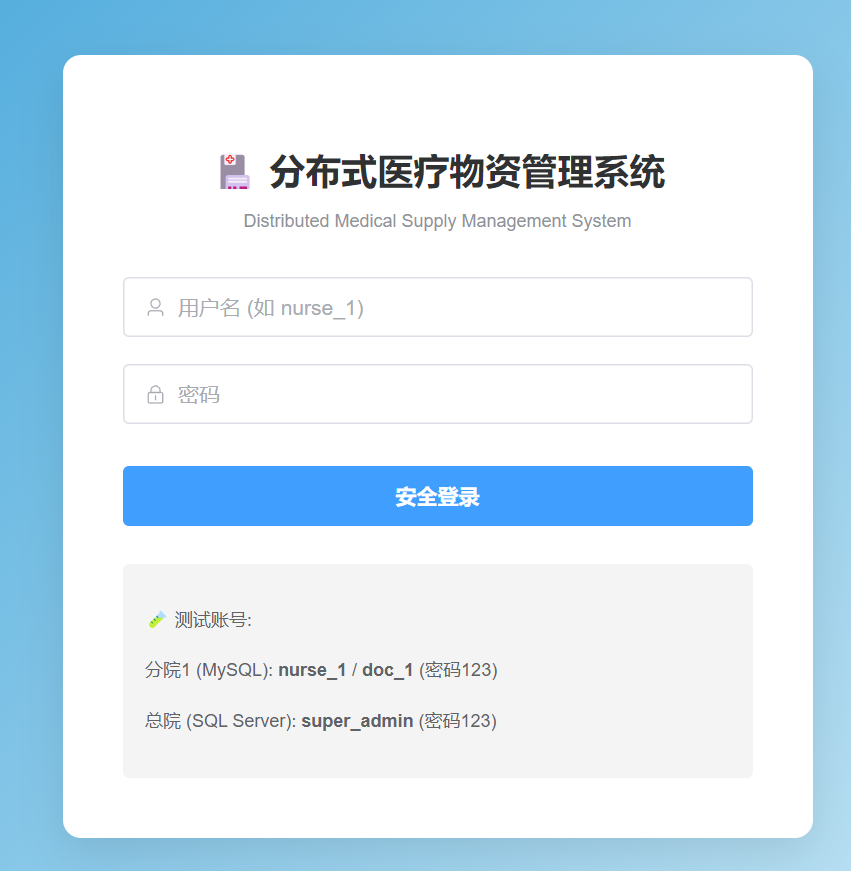
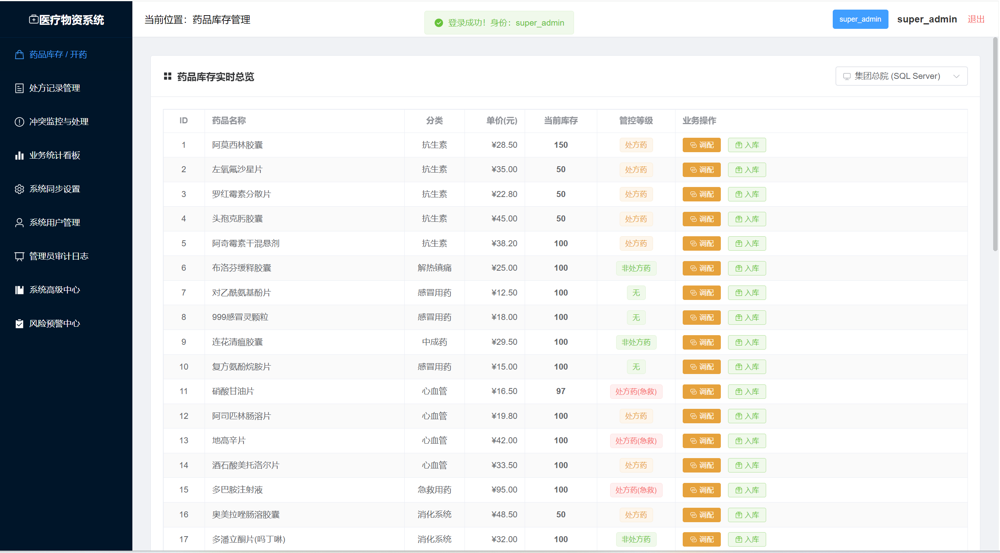
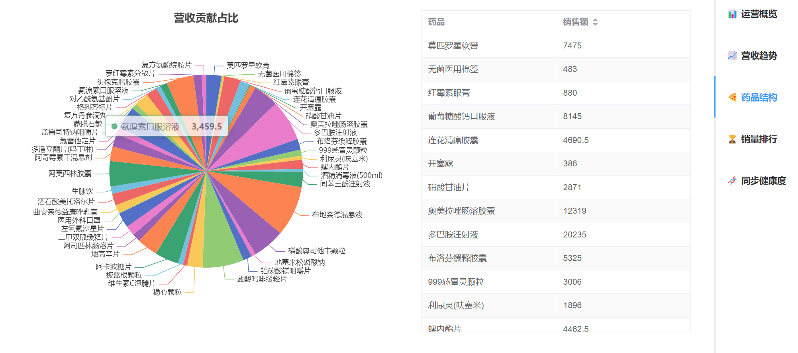
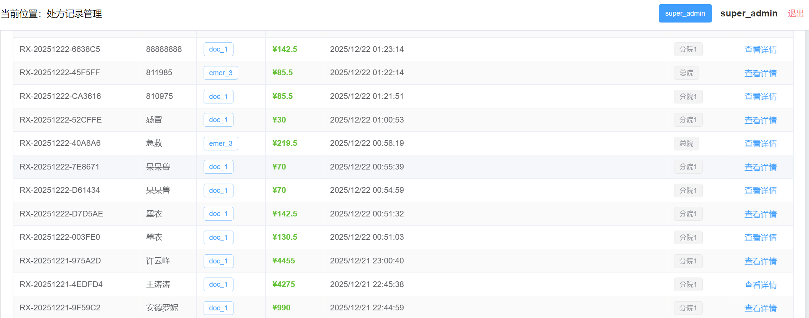

# 分布式医疗物资同步管理系统 (DMSMDS)

本项目为《数据库系统实践》课程设计，实现了一个跨地域、多节点、异构数据库环境下的医疗物资管理与实时同步系统。

## 🚀 核心亮点
- **三库异构同步**：支持 MySQL, PostgreSQL, SQL Server 之间的实时数据广播。
- **冲突决策机制**：首创分布式 Owner 归属权校验，支持三向冲突人工仲裁。
- **高级数据库编程**：
  - **存储过程**：实现复杂的处方开具与权限校验逻辑。
  - **触发器**：实现高额处方自动实时审计。
  - **游标**：实现基于逐行扫描的智能库存诊断报表。
- **性能优化**：针对 15 万级大数据量设计复合索引，实现查询性能百倍提升。
- **全系统 Docker 化**：支持一键部署（前端、后端、三家数据库）。

## 🛠️ 技术栈
- **前端**：Vue 3 + Element Plus + ECharts 5
- **后端**：FastAPI (Python) + SQLAlchemy + APScheduler
- **部署**：Docker + Docker Compose

## 📦 快速启动
1. 确保安装了 Docker Desktop。
2. 在根目录运行：`docker-compose up --build -d`
3. 访问：`http://localhost` (前端) 或 `http://localhost:8000/docs` (API文档)。

## 📸 功能截图

